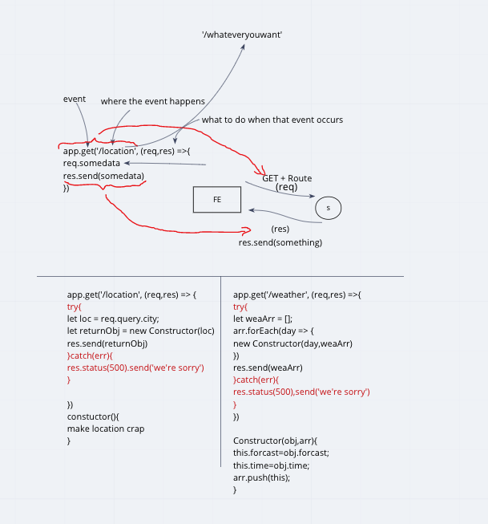
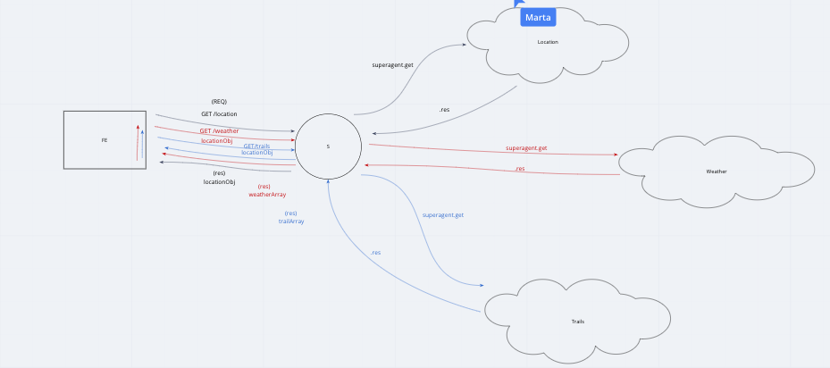

# city-explorer
**Author**: Sean Murray
**Version**: 1.5.0 

## Overview
This will be a simple API to serve information for the City Explorer Front end.

## Getting Started

### Step 1:
Once you have cloned the repo in the command line run:

```
npm i
```
### Step 2:
Create a local **.env** file and insert the following:
 - openport should be a number for an open port on your machine.
```
PORT=<openport>
```

### Step 3:
To start the server run the following in the terminal:

```
npm start
```

## Architecture
This API is designed to handle GET requests on /location and /weather routes to serve data to a front end.

### Libraries Used:
 - Express
 - dotenv
 - cors
 - superagent

## Change Log
 - 06-08-2020 1531 - Application now has functional GET route for location.

 - 06-08-2020 1615 Application now has function Get route for weather.

 - 06-09-2020 1530 Application now uses API calls to query search data, and GET route for trails.

## Credits and Collaborations

## Time Estimations:

**Number and name of feature:** Location

**Estimate of time needed to complete:** 30min

**Start time:** 1500

**Finish time:** 1530

**Actual time needed to complete:** 30min


**Number and name of feature:** Weather

**Estimate of time needed to complete:** 30min

**Start time:** 1545

**Finish time:** 1600

**Actual time needed to complete:** 15min


**Number and name of feature:** Trails

**Estimate of time needed to complete:** 30min

**Start time:** 1430

**Finish time:** 1500

**Actual time needed to complete:** 30min


**Number and name of feature:** Superagent + API

**Estimate of time needed to complete:** 30min

**Start time:** 1445

**Finish time:** 1515

**Actual time needed to complete:** 30min

## Whiteboards for logic:

### Day 1



### Day 2


